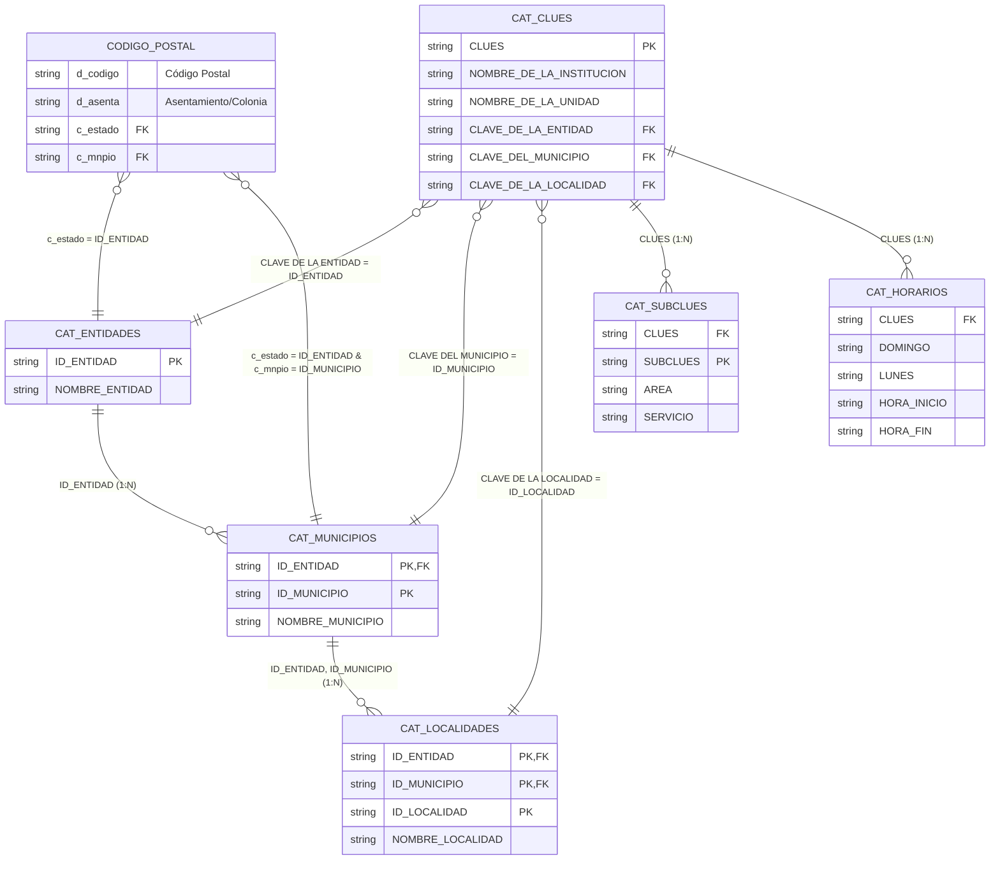

# Árbol de Directorios Extendido - Catálogos Fundamentales SDM

directives/
└── catalogos/
    ├── CAT_CLUES.md
    ├── CAT_LOCALIDADES.md
    ├── CAT_MUNICIPIOS.md
    ├── CAT_ENTIDADES.md
    ├── CODIGO_POSTAL.md
    ├── CAT_NACIONALIDADES.md
    ├── CAT_DIAGNOSTICOS.md
    ├── CAT_PROCEDIMIENTOS.md
    ├── CAT_CIF.md
    ├── CAT_MATERIAL_CURACION.md
    ├── CAT_INSTRUMENTAL_EQUIPO_MEDICO.md
    ├── CAT_MEDICAMENTOS.md
    ├── CAT_VIA_ADMINISTRACION.md
    ├── CAT_FORMACION.md
    ├── CAT_LENGUAS_INDIGENAS.md
    └── CAT_RELIGION.md

dat/
└── catalogosOF/
    ├── CAT_CLUES.dat
    ├── CAT_LOCALIDADES.dat
    ├── CAT_MUNICIPIOS.dat
    ├── CAT_ENTIDADES.dat
    ├── CODIGO_POSTAL.dat
    ├── CAT_NACIONALIDADES.dat
    ├── CAT_DIAGNOSTICOS.dat
    ├── CAT_PROCEDIMIENTOS.dat
    ├── CAT_CIF.dat
    ├── CAT_MATERIAL_CURACION.dat
    ├── CAT_INSTRUMENTAL_EQUIPO_MEDICO.dat
    ├── CAT_MEDICAMENTOS.dat
    ├── CAT_VIA_ADMINISTRACION.dat
    ├── CAT_FORMACION.dat
    ├── CAT_LENGUAS_INDIGENAS.dat
    └── CAT_RELIGION.dat

# Lista de Verificación - Catálogos Fundamentales SDM (con Paths y Archivos)

| Verificado | Identificador | Registros | Archivo .md | Archivo .dat |
|------------|---------------|-----------|-------------|--------------|
| [X] | CAT_CLUES | 63,802 | directives/catalogos/CAT_CLUES.md | /dat/catalogosOF/CAT_CLUES.dat |
| [X] | CAT_SUBCLUES | 3,980 | directives/catalogos/CAT_SUBCLUES.md | /dat/catalogosOF/CAT_SUBCLUES.dat |
| [X] | CAT_HORARIOS | 58,205 | directives/catalogos/CAT_HORARIOS.md | /dat/catalogosOF/CAT_HORARIOS.dat |
| [X] | CAT_LOCALIDADES | 300,685 | directives/catalogos/CAT_LOCALIDADES.md | /dat/catalogosOF/CAT_LOCALIDADES.dat |
| [X] | CAT_MUNICIPIOS | 2,475 | directives/catalogos/CAT_MUNICIPIOS.md | /dat/catalogosOF/CAT_MUNICIPIOS.dat |
| [X] | CAT_ENTIDADES | 39 | directives/catalogos/CAT_ENTIDADES.md | /dat/catalogosOF/CAT_ENTIDADES.dat |
| [X] | CODIGO_POSTAL | 158,481 | directives/catalogos/CODIGO_POSTAL.md | /dat/catalogosOF/CODIGO_POSTAL.dat |
| [X] | CAT_CIF_1erNivel | 28 | directives/catalogos/CAT_CIF_RELACIONES.md | /dat/catalogosOF/CAT_CIF_1erNivel.dat |
| [X] | CAT_CIF_2oNivel | 378 | directives/catalogos/CAT_CIF_RELACIONES.md | /dat/catalogosOF/CAT_CIF_2oNivel.dat |
| [X] | CAT_CIF_3erNivel | 1,092 | directives/catalogos/CAT_CIF_RELACIONES.md | /dat/catalogosOF/CAT_CIF_3erNivel.dat |
| [X] | CAT_CIF_4oNivel | 179 | directives/catalogos/CAT_CIF_RELACIONES.md | /dat/catalogosOF/CAT_CIF_4oNivel.dat |
| [X] | CAT_CIE10_DIAGNOSTICOS | 14,498 | directives/catalogos/CAT_CIE10_DIAGNOSTICOS_DESC.md | /dat/catalogosOF/CAT_CIE10_DIAGNOSTICOS.dat |
| [X] | CAT_CIE09_PROCEDIMIENTOS | 4,978 | directives/catalogos/CAT_CIE09_PROCEDIMIENTOS.md | /dat/catalogosOF/CAT_CIE09_PROCEDIMIENTOS.dat |
| [ ] | CAT_MATERIAL_CURACION | - | directives/catalogos/CAT_MATERIAL_CURACION.md | /dat/catalogosOF/CAT_MATERIAL_CURACION.dat |
| [ ] | CAT_INSTRUMENTAL_EQUIPO_MEDICO | - | directives/catalogos/CAT_INSTRUMENTAL_EQUIPO_MEDICO.md | /dat/catalogosOF/CAT_INSTRUMENTAL_EQUIPO_MEDICO.dat |
| [ ] | CAT_MEDICAMENTOS | - | directives/catalogos/CAT_MEDICAMENTOS.md | /dat/catalogosOF/CAT_MEDICAMENTOS.dat |
| [ ] | CAT_VIA_ADMINISTRACION | - | directives/catalogos/CAT_VIA_ADMINISTRACION.md | /dat/catalogosOF/CAT_VIA_ADMINISTRACION.dat |
| [X] | CAT_FORMACION | 7,130 | directives/catalogos/CAT_FORMACION.md | /dat/catalogosOF/CAT_FORMACION.dat |
| [ ] | CAT_LENGUAS_INDIGENAS | - | directives/catalogos/CAT_LENGUAS_INDIGENAS.md | /dat/catalogosOF/CAT_LENGUAS_INDIGENAS.dat |
| [X] | CAT_RELIGION | 250 | directives/catalogos/CAT_RELIGION.md | /dat/catalogosOF/CAT_RELIGION.dat |
| [X] | CAT_NACIONALIDADES | 173 | directives/catalogos/CAT_NACIONALIDADES.md | /dat/catalogosOF/CAT_NACIONALIDADES.dat |

## Arquitectura de Relaciones y Databinding para Formularios

Esta sección define el modelo y flujo para utilizar los catálogos en formularios (ej. domicilios) logrando un databinding unidireccional y autocompletado mediante el Código Postal, garantizando que estos catálogos de consulta nunca sean modificados.

### 1. Modelo de Entidad-Relación (ER)

### 2. Flujo de Databinding Unidireccional (UI/UX)

1. **Interacción Frontend (Capa 4 - UI/UX Diamond)**
   - El usuario ingresa 5 dígitos en el campo `Código Postal`.
   - Los campos `Entidad` y `Municipio` son estáticos (`readonly`).
   - Al detectar exactamente 5 dígitos, se dispara una petición asíncrona a la API de backend.
   - **Mapeo UI**: `Entidad` y `Municipio` se autocompletan. La selección de asentamiento se convierte en un `<select>` unificado.

2. **Resolución Backend (Capa 3 - Ejecución Perl API)**
   - La API realiza una búsqueda en `CODIGO_POSTAL.dat` usando el `d_codigo`.
   - Extrae `c_estado` y `c_mnpio` para resolver los nombres en `CAT_ENTIDADES.dat` y `CAT_MUNICIPIOS.dat`.
   - **Mecanismo de Fallback**: Para poblar el `<select>` de colonias/localidades, el backend prioriza los asentamientos de SEPOMEX (`d_asenta` en `CODIGO_POSTAL.dat`). **Solo en caso de que no existan colonias registradas para dicho Código Postal**, el sistema acudirá a `CAT_LOCALIDADES.dat` del INEGI como respaldo para mostrar las localidades oficiales de ese municipio. Esto evita la saturación visual y mantiene la eficiencia.
