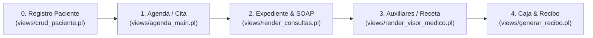

# Flujo Global de Atención Médica y Consultas SOAP Polimórficas

## 1. Pipeline Unificado de Atención Médica

---

## 2. Descripción de las Etapas de Atención

1. **Recepción y Registro**: Alta de datos de identificación, cálculo automático de edad y apertura de expediente.
2. **Agendamiento**: Asignación de turno, horario, especialidad y médico tratante.
3. **Atención Médica SOAP**: Registro de signos vitales, exploración física y nota clínica.
4. **Auxiliares y Medicamentos**: Emisión de recetas y consulta PACS de laboratorio/imagenología.
5. **Cierre y Caja**: Emisión del recibo de cobro en ventanilla en **Caja Rápida**.

---

## 3. Las 3 Reglas de Oro de Arquitectura SOAP Polimórfica

1. **Contrato de Datos JSON SOAP Canónico**:
   Toda consulta clínica privada debe serializarse en `dat/consultas_clinicas.dat` bajo las 4 llaves principales:
   - **`subjective`**: Anamnesis, motivo de consulta y padecimiento actual.
   - **`objective`**: Signos vitales universales (`TA`, `FC`, `FR`, `Temp`, `Peso`, `Talla`, `IMC`, `SpO2`) y subformulario del especialista (`soap.objective.especialidad_data`).
   - **`assessment`**: Diagnóstico principal CIE-10, diagnósticos secundarios e impresión clínica.
   - **`plan`**: Plan terapéutico, indicaciones, prescripciones y órdenes auxiliares.
2. **Core Pipeline Único (80% compartido)**:
   Existe un solo wizard principal (`render_consultas_privado.pl`). Está **estrictamente prohibido duplicar vistas por especialidad** (no crear `consulta_pediatria.pl` ni `consulta_ginecologia.pl`).
3. **Subformularios Desacoplados (Plugin Slot 20% dinámico)**:
   Los componentes por especialidad residen en `views/partials/consultas/` o `views/partials/especialidades/`. Si una especialidad aún no cuenta con subformulario nativo, se renderiza el Módulo Fallback Universal con signos vitales.

---

## 4. Innovaciones Técnicas y Mecanismos de Control

### 4.1 Restricción Estricta de Consulta Única Activa por Médico
- Un médico no puede mantener 2 consultas abiertas simultáneamente.
- `render_consultas_privado.pl` analiza `citas.dat`. Si el facultativo posee una cita previa en estado `En consulta`, bloquea la navegación desplegando una alerta SweetAlert2 que exige finalizar la consulta previa.

### 4.2 Trazabilidad de Consulta Activa en Expediente
- En `render_expediente_clinico.pl`, cuando una cita está `En consulta`, el botón del timeline cambia a **`Continuar con la consulta ▶`** (`btn-info text-white`).
- En el modal resumen del directorio de pacientes (`pacientes.pl`), se despliega el badge **`En Consulta`** con enlace directo a la sesión activa.

### 4.3 Grid Responsivo de 4 Columnas
- En `step_registro_privado.pl`, los formularios se estructuran bajo `col-12 col-md-3` (4 columnas simétricas en escritorio/tablet y 1 columna en móvil).

### 4.4 Trazabilidad de Tratamientos Abiertos y Cargos Directos
- **Seguimiento Activo**: Si el paciente posee un tratamiento abierto en `dat/tratamientos.dat`, el Paso 0 inyecta automáticamente el `id_tratamiento` bloqueando el tipo a *Seguimiento* y calculando el balance histórico en `estado_cuenta.dat`.
- **Cargos Directos (`modalCargoConsultas`)**: Permite agregar servicios/medicamentos adicionales durante la consulta en memoria. Al confirmar, serializa en `caja_items_json` para que `cerrar_consulta_privado.pl` genere o anexe los cargos a la orden de servicio.

### 4.5 Solución al Conflicto de Apilamiento (Backdrop Trap)
- Modales anidados (`modalCargoConsultas`, `modalCita`) ejecutan `document.body.appendChild(modalEl)` al abrirse para renderizarse fuera del contenedor del wizard y evitar quedar atrapados tras el telón oscuro de Bootstrap (`.modal-backdrop`).

### 4.6 Hub PACS e Integración de Estudios Complementarios
- En `step_estudios.pl`, se consulta `dat/estudios.dat` por paciente. Muestra miniaturas de previsualización (`.jpg`, `.png`), enlace directo al Visor DICOM (`render_visor_medico.pl`) y switch de asignación para concatenar la descripción del estudio en las notas del informe.
