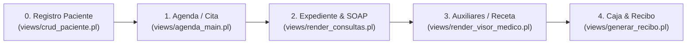

# Flujo Global de Atención Médica y Consultas SOAP Polimórficas

## 1. Pipeline Unificado de Atención Médica

```mermaid
graph LR
    Paso0["0. Registro Paciente<br/>(views/crud_paciente.pl)"] --> Paso1["1. Agenda / Cita<br/>(views/agenda_main.pl)"]
    Paso1 --> Paso2["2. Expediente & SOAP<br/>(views/render_consultas.pl)"]
    Paso2 --> Paso3["3. Auxiliares / Receta<br/>(views/render_visor_medico.pl)"]
    Paso3 --> Paso4["4. Caja & Recibo<br/>(views/generar_recibo.pl)"]
```

---

## 2. Descripción de las Etapas de Atención

1. **Recepción y Registro**: Alta de datos de identificación, cálculo automático de edad y apertura de expediente.
2. **Agendamiento**: Asignación de turno, horario, especialidad y médico tratante.
3. **Atención Médica SOAP**: Registro de signos vitales, exploración física y nota clínica.
4. **Auxiliares y Medicamentos**: Emisión de recetas y consulta PACS de laboratorio/imagenología.
5. **Cierre y Caja**: Emisión del recibo de cobro en ventanilla en **Caja Rápida**.

---

## 3. Las 3 Reglas de Oro de Arquitectura SOAP Polimórfica

1. **Contrato de Datos JSON SOAP Canónico**:
   Toda consulta clínica privada debe serializarse en `dat/consultas_clinicas.dat` bajo las 4 llaves principales:
   - **`subjective`**: Anamnesis, motivo de consulta y padecimiento actual.
   - **`objective`**: Signos vitales universales (`TA`, `FC`, `FR`, `Temp`, `Peso`, `Talla`, `IMC`, `SpO2`) y subformulario del especialista (`soap.objective.especialidad_data`).
   - **`assessment`**: Diagnóstico principal CIE-10, diagnósticos secundarios e impresión clínica.
   - **`plan`**: Plan terapéutico, indicaciones, prescripciones y órdenes auxiliares.
2. **Core Pipeline Único (80% compartido)**:
   Existe un solo wizard principal (`render_consultas_privado.pl`). Está **estrictamente prohibido duplicar vistas por especialidad** (no crear `consulta_pediatria.pl` ni `consulta_ginecologia.pl`).
3. **Subformularios Desacoplados (Plugin Slot 20% dinámico)**:
   Los componentes por especialidad residen en `views/partials/consultas/` o `views/partials/especialidades/`. Si una especialidad aún no cuenta con subformulario nativo, se renderiza el Módulo Fallback Universal con signos vitales.

---

## 4. Innovaciones Técnicas y Mecanismos de Control

### 4.1 Restricción Estricta de Consulta Única Activa por Médico, Citas Espontáneas y Estado "Consulta en proceso"
- **Bloqueo Inviolable de Sesión Concurrente**: Un médico tratante tiene estrictamente prohibido mantener 2 o más consultas abiertas en paralelo.
  - Al acceder a `render_consultas_privado.pl`, el sistema analiza `citas.dat`. Si el facultativo cuenta con una consulta en estado `Consulta en proceso` o `En consulta`, la navegación se intercepta con una alerta modal SweetAlert2 que exige concluir y cerrar la consulta activa antes de iniciar otra.
  - **Detección y Sincronización de Citas Espontáneas (Walk-in / Sin Cita Previa)**:
    - Si el médico accede de manera directa (por ejemplo, desde el expediente o directorio sin `id_cita`), el backend verifica primero si el paciente ya tenía una cita programada para hoy o si ya se encontraba en sesión activa con dicho paciente (evitando alertas duplicadas en recargas `F5`).
    - Si no existe cita previa, el backend genera automáticamente un registro formal completo de 16 columnas en `citas.dat` con estado **`Consulta en proceso`**, color clínico `#059669`, hora de inicio actual y proyección a +30 minutos.
    - Se actualiza la URL del cliente de forma transparente (`history.replaceState`) inyectando `id_cita`, lo que asegura trazabilidad total, persistencia de borradores y cuadre en la agenda.
  - **Reflejo Inmediato en la Agenda (`agenda_main.pl` / `js/agenda_spa_new.js`)**:
    - La cita se marca en el grid y timeline bajo el estado **`Consulta en proceso`** con badge verde clínico (`#059669` / `bg-teal text-white`).
    - Se habilita el botón de acción directa **`Ir a Consulta en Proceso ▶`** para acceder o retomar la sesión.
    - La cita queda protegida contra drag-and-drop, eliminación accidental y contra la regla de vencimiento (`auto_actualizar_citas_vencidas`), impidiendo que sea marcada erróneamente como `No realizada` si la atención excede el tiempo estimado.
- **Aislamiento Estricto de Borradores (Anti-Herencia de Datos)**:
  - Los borradores en `dat/consulta_draft.dat` se indexan y filtran de manera estricta por `id_paciente` e `id_cita`. Nunca se cargan datos de consultas o citas pasadas.
  - Al iniciar una nueva consulta, el formulario se inicializa con `autocomplete="off"` y se ejecuta una purga preventiva en el DOM que limpia todos los campos de texto, signos vitales, textareas y vacía los carritos de medicamentos y caja en memoria.
  - Al concluir la consulta en `api/cerrar_consulta_privado.pl`, la cita pasa inmutablemente a `Atendida`, se elimina cualquier borrador asociado y se resetea el estado del formulario liberando el cerrojo del médico.

### 4.2 Trazabilidad de Consulta en Proceso en Expediente y Directorio
- En `render_expediente_clinico.pl`, cuando una cita está `Consulta en proceso` o `En consulta`, el botón del timeline y hub clínico cambia a **`Continuar con la consulta ▶`** (`btn-info text-white`).
- En el modal resumen del directorio de pacientes (`pacientes.pl`), se despliega el badge **`Consulta en proceso`** con enlace directo a la sesión activa.

### 4.3 Grid Responsivo de 4 Columnas
- En `step_registro_privado.pl`, los formularios se estructuran bajo `col-12 col-md-3` (4 columnas simétricas en escritorio/tablet y 1 columna en móvil).

### 4.4 Trazabilidad de Tratamientos Abiertos y Cargos Directos
- **Seguimiento Activo**: Si el paciente posee un tratamiento abierto en `dat/tratamientos.dat`, el Paso 0 inyecta automáticamente el `id_tratamiento` bloqueando el tipo a *Seguimiento* y calculando el balance histórico en `estado_cuenta.dat`.
- **Cargos Directos (`modalCargoConsultas`)**: Permite agregar servicios/medicamentos adicionales durante la consulta en memoria. Al confirmar, serializa en `caja_items_json` para que `cerrar_consulta_privado.pl` genere o anexe los cargos a la orden de servicio.

### 4.5 Solución al Conflicto de Apilamiento (Backdrop Trap)
- Modales anidados (`modalCargoConsultas`, `modalCita`) ejecutan `document.body.appendChild(modalEl)` al abrirse para renderizarse fuera del contenedor del wizard y evitar quedar atrapados tras el telón oscuro de Bootstrap (`.modal-backdrop`).

### 4.6 Hub PACS e Integración de Estudios Complementarios
- En `step_estudios.pl`, se consulta `dat/estudios.dat` por paciente. Muestra miniaturas de previsualización (`.jpg`, `.png`), enlace directo al Visor DICOM (`render_visor_medico.pl`) y switch de asignación para concatenar la descripción del estudio en las notas del informe.

### 4.7 Sincronización Temporal al Momento Real y Trazabilidad de Citas
- **Principio de Veracidad y Cronología Real (NOM-004-SSA3)**: Al tomar una cita médica desde la agenda (sea una cita extemporánea del pasado, del presente o reagendada), el sistema asume que el acto médico ocurre en tiempo presente. En consecuencia, el wizard clínico (`render_consultas_privado.pl` y `render_consultas.pl`) sincroniza automáticamente `fecha_consulta` y `hora_consulta` al día y hora actuales (`$hoy_fecha`, `$hoy_hora`), proyectando la hora de término calculada.
- **Sincronización en `dat/citas.dat`**: La cita actualiza su fecha (`col 3`) y hora de inicio (`col 4`) al momento real de atención, fijando su estado en `En consulta`.
- **Bitácora de Trazabilidad en Notas**: Para no perder el registro de la programación original, el sistema concatena automáticamente una marca de auditoría en el campo de notas (`col 7`): `[Atencion: YYYY-MM-DD HH:MM (Prog. original: YYYY-MM-DD HH:MM)]`.
- **Cierre Integral y Cuadre de Caja**: Al finalizar la consulta en `api/cerrar_consulta_privado.pl` o `api/cerrar_consulta.pl`, la cita se sella de forma inmutable como `Atendida` en la fecha real, cuadrando al 100% con los recibos de caja, recetas médicas y consentimientos informados emitidos en esa misma jornada.

### 4.8 Integración de Odontogramas Clínicos y Rayos X (PACS) en Consulta y Detalle
- **Paso 3 Exploración Física (`step_exploracion.pl`)**: Integra la tabla interactiva `#tablaConsultaOdontogramas` (con 6 columnas: `Asignar`, `Preview`, `Fecha`, `Estado`, `Descripción / Alias` y `Acciones`), permitiendo seleccionar y anexar hallazgos odontológicos previos directamente en el campo de texto de hallazgos mediante un toggle switch reactivo (`toggleOdontoToExploracion`).
- **Jerarquización en Odontología y Retiro de Subformulario Legacy**: Para la especialidad Odontología (`$is_odontologia`), se retiró el antiguo subformulario de 6 botones y su script desactualizado (`odontograma_spa.js`). La tabla de Odontogramas Clínicos Disponibles asume el rol protagónico en la exploración objetiva, acompañada del botón de acción rápida **`+ Nuevo Odontograma`** (enlazado directamente al Visor Odontograma Pro `views/render_visor_odontograma.pl`) y el botón **`Evolución`** para generar nuevas versiones clínicas preservando el diagnóstico base.
- **Segregación Polimórfica en Especialidades No Odontológicas**: Para especialidades distintas a odontología, se mantiene el encabezado "Exploración Dirigida por Especialidad" con su slot modular desacoplado (`#especialidad-subformulario-container`), evitando desplegar tablas o advertencias odontológicas innecesarias.
- **Persistencia Multi-Selección (`api/cerrar_consulta_privado.pl` y `api/cerrar_consulta.pl`)**: Almacenamiento dinámico como `ARRAY` o escalar para `odonto_estudios_seleccionados` y `pacs_estudios_seleccionados` dentro del payload JSON en `dat/consultas_clinicas.dat`.
- **Despliegue Dinámico en `views/consulta_detalles.pl`**: Si se asignaron odontogramas o estudios de rayos X / PACS durante la consulta (detectados por ID en payload o por marcas canónicas en el texto clínico), se renderizan bloques visuales estructurados dentro de la tarjeta Bento de **Exploración Física (Paso 3)** con miniaturas, badges de estado/modalidad, desglose de piezas/presupuesto y enlaces directos a sus visores especializados (`render_visor_odontograma.pl` y `render_visor_medico.pl`).

### 4.9 Evolución Clínica, Inyección en Caja y Finalización de Odontogramas (Especialidad Odontología)
- **Clonación Atómica para Evolución Clínica ("Antes y Después")**: En el Paso 3 (`step_exploracion.pl`), si el médico tratante es de especialidad Odontología (`$is_odontologia`), la tabla de odontogramas expone el botón de acción **`Evolución`** (`crearEvolucionOdonto`). Al pulsarlo, `api/odontograma_api.pl?accion=clone` duplica de forma profunda el estado de piezas, superficies y periodontograma bajo el alias `Evolución - DD/MM/YYYY HH:MM` con estado `En Proceso`. Esto permite al odontólogo documentar los procedimientos y tratamientos efectuados en la sesión sin corromper el diagnóstico basal inicial.
- **Inyección Automática a Conceptos a Cobrar (Paso 6 `step_caja_privado.pl`)**: Cuando la consulta corresponde a Odontología, se despliega el banner `#caja-odonto-banner` que detecta el odontograma asignado en el Paso 3. A través de `api/odontograma_api.pl?accion=get_treatments`, desglosa los tratamientos presupuestados y los inyecta en el carrito de cargos (`carritoConsulta` y `caja_items_json`), recalculando en tiempo real los totales, abonos y destino del tratamiento.
- **Sello y Finalización Automática de Odontograma (`api/cerrar_consulta_privado.pl`)**: Al finalizar y cerrar la consulta, el backend evalúa el switch `odonto_finalizar_al_cerrar` o la especialidad odontológica, actualizando concurrentemente con `flock` el odontograma asignado a estado `Finalizado` con timestamp tanto en `dat/odontogramas/paciente_[id].json` como en `dat/odontogramas.dat`.

### 4.10 Módulo Universal de Dictado Clínico por Voz (Speech-to-Text) y Limpieza de Campos
- **Despliegue Integral en el Pipeline Clínico SOAP**:
  - **Paso 1 Ficha y Registro (`step_registro_privado.pl`)**: Toolbar en `textarea[name="motivo"]` (**Motivo Principal de Consulta**).
  - **Paso 2 Anamnesis (`step_anamnesis.pl`)**: Toolbars en `textarea[name="evolucion"]` (**Evolución y Síntomas**), `textarea[name="antecedentes_patologicos"]` (**Patológicos**) y `textarea[name="alergias"]` (**Alergias**).
  - **Paso 3 Exploración Física (`step_exploracion.pl`)**: Toolbar en `textarea[name="exploracion_hallazgos"]` (**Hallazgos Clínicos**).
  - **Paso 4 Auxiliares y Estudios (`step_estudios.pl`)**: Toolbar en `textarea[name="resultados_estudios"]` (**Resultados e Interpretación de Estudios**).
  - **Paso 5 Evaluación SOAP (`step_soap.pl`)**: Toolbars en `textarea[name="impresion_clinica"]` (**Impresión Clínica / Assessment**) y `textarea[name="plan_tratamiento"]` (**Plan de Tratamiento / Plan**).
  - **Paso 6 Comunicación y Acuerdos (`step_comunicacion.pl`)**: Toolbar en `textarea[name="com_observaciones"]` (**Observaciones Adicionales de la Interacción**).
- **Arquitectura Universal y Reutilizable para N Campos (`js/dictado_voz.js`)**: 
  - El motor `window.toggleDictadoVoz(targetSelector, btnElement)` está desacoplado para operar sobre cualquier selector CSS o elemento `textarea` / `input` presente o futuro del sistema.
  - Resolución contextual de indicadores de feedback visual (`.dictado-live-badge`) por proximidad jerárquica en el DOM sin requerir identificadores unívocos rígidos.
  - Reconocimiento continuo nativo con Web Speech API en español (`es-MX`) y transcripción fluida en tiempo real (`interimResults`).
- **Botón Universal de Limpieza Segura (`limpiarCampoTexto`)**:
  - Función global `window.limpiarCampoTexto(targetSelector)` que resetea el valor, enfoca el control y despacha automáticamente los eventos reactivos `input` y `change` para sincronización con `autosave.js` y validación de obligatoriedad.
  - Incorpora confirmación preventiva SweetAlert2 cuando el texto supera 25 caracteres para evitar borrados accidentales de notas clínicas extensas.

### 4.11 Saneamiento Integral y Codificación Canónica UTF-8 en el Step de Caja
- **Protección contra Doble Codificación (Mojibake)**:
  - En `views/partials/consultas/step_caja_privado.pl`, las estructuras de cotizaciones (`$json_cots`) y balance clínico-financiero (`$json_historial`) se serializan mediante `JSON::PP->new->ascii(1)->encode(...)`, garantizando que todos los caracteres diacríticos (acentos, eñes, diéresis) se escapen limpiamente como secuencias `\uXXXX` inmunes a desajustes de capas de entrada/salida de Perl o servidores web.
  - Implementación de la función JavaScript reactiva `fixUTF8(str)` para reparar al vuelo cualquier residuo de doble codificación UTF-8 (`decodeURIComponent(escape(str))`) al cargar ítems del catálogo (`#tablaCatalogoConsultas`), conceptos del carrito (`#listaCarritoConsultas`), cargos del tratamiento activo, cotizaciones y tratamientos odontológicos. Para evitar que el motor de interpolación de Perl en bloques `qq{}` consuma las barras invertidas `\` y provoque errores de `SyntaxError: Invalid regular expression: Range out of order in character class`, la detección se realiza limpiamente mediante `str.indexOf('Ã') !== -1 || str.indexOf('Â') !== -1`.
- **Blindaje en Endpoints Financieros (`api/estado_cuenta_api.pl`)**:
  - Inclusión de `binmode STDOUT, ':raw'` y cabecera canónica `Content-Type: application/json; charset=UTF-8` en todas las respuestas (incluyendo rechazos de autenticación 401 y `get_catalogo`).
  - Saneamiento estructural en `dat/negocios.dat` y eliminación de firmas BOM para una resolución transparente de la organización raíz y su catálogo universal asociado.
- **Escape de Sigilos de Perl**:
  - Corrección de secuencias de moneda en cadenas interpoladas (ej. `\$0.00` y `\$500.00`), previniendo advertencias de variables no inicializadas y fugas de contexto en el DOM.

### 4.12 Garantía Canónica de Expediente y Especialidad Inamovible en Step 1
- **Principio de Existencia de Expediente Clínico**:
  - Para que exista cualquier acto o registro de consulta clínica, los datos esenciales del paciente (**Paciente**, **CURP**, **Sexo**, **Edad**) y la **Especialidad (Inamovible)** del médico tratante DEBEN estar siempre poblados e inmutables en pantalla.
- **Resolución Multinivel con Fallback Canónico (`render_consultas_privado.pl`)**:
  - El backend analiza en cascada: (1) parámetro directo `id` o `id_paciente`, (2) asociación por cita activa `id_cita` en `dat/citas.dat`, (3) primer expediente activo con registro en `dat/pacientes.dat` o catálogos CLUE (`pacientes_privados_*.dat`), y (4) expediente canónico estructurado garantizado en `_estructurar_paciente()`.
  - Normalización de la Especialidad Médica Inamovible mapeada contra `dat/usuarios.dat` y `dat/especialidades.dat` (asignando `Medicina General` u `Odontología` si el ID es `0` o no configurado).
- **Inmunidad y Blindaje contra Limpieza de Formulario (JavaScript)**:
  - En `DOMContentLoaded`, la rutina de reseteo preventivo del formulario excluye taxativamente controles de solo lectura o protegidos: `input:not([type=hidden]):not([type=date]):not([readonly]):not([data-preserve="true"])`.
  - En `views/partials/consultas/step_registro_privado.pl`, los inputs se configuran con identificadores explícitos (`#f_paciente_nombre`, `#f_paciente_curp`, `#f_paciente_sexo`, `#f_paciente_edad`, `#f_paciente_espe`), atributos `readonly` y `data-preserve="true"`.
  - En la restauración de borradores (`autosave.js` / `draftData`), se ignora la sobreescritura de claves reservadas (`fecha_consulta`, `hora_consulta`, `paciente_*`, `especialidad`, `id_espe`), blindando la inmutabilidad de los datos basales.

### 4.13 Refactorización Premium y Modo Hoja WYSIWYG de Impresión Carta Vertical (`views/consulta_detalles.pl`)
- **Visualización Dual de Vanguardia (Pantalla)**:
  - **Modo Dashboard Bento**: Interfaz interactiva de alta fidelidad orientada a la revisión clínica en estación de trabajo, con tarjetas Bento Grid, micro-interacciones, badges de severidad y accesos directos al Visor PACS (`render_visor_medico.pl`) y Visor Odontograma (`render_visor_odontograma.pl`).
  - **Modo Hoja WYSIWYG (Carta Vertical)**: Réplica exacta fotorrealista de la hoja membretada de papel tamaño carta (`8.5in x 11in`), permitiendo al profesional de la salud visualizar en tiempo real cómo se imprimirá o exportará el documento antes de emitirlo.
- **Especificaciones Quirúrgicas de Impresión y Exportación a PDF**:
  - **Estándar `@page`**: `@page { size: letter portrait; margin: 8mm 8mm 8mm 8mm; }` (orientación vertical Carta, márgenes estrechos óptimos para aprovechar el 100% de la superficie útil).
  - **Membrete Institucional Oficial**: Despliegue de datos de la Organización desde `dat/negocios.dat` (Nombre comercial, Razón Social, RFC, Clave CLUES, Domicilio Fiscal completo, Teléfono, Correo Electrónico y Logo institucional).
  - **Ficha Dual de Identificación**: Resumen simétrico del Paciente (Nombre, CURP, Sexo, Edad, Tipo de Sangre, Teléfono, Alergias) y del Médico Tratante Responsable (Nombre con título, Especialidad, Cédula Profesional, Consultorio).
  - **Pipeline Completo del Wizard SOAP**: Desglose secuencial de los campos de referencia: (1) Anamnesis y Motivo de Consulta con escala visual de dolor, (2) Exploración Física con cuadrícula de Signos Vitales (T.A., F.C., F.R., Temp, SpO2, IMC y estado nutricional), (3) Diagnóstico CIE-10 codificado, Severidad, Pronóstico y Plan Terapéutico, (4) Prescripción Farmacológica estructurada en tabla (Fármaco, Presentación, Dosis, Frecuencia, Duración, Vía e Indicaciones), y (5) Bloque de Conformidad y Firmas Digitales con leyenda legal de validez NOM-004-SSA3-2012.
  - **Reglas Anti-Corte de Página**: Implementación de `page-break-inside: avoid; break-inside: avoid;` en cuadrículas de signos vitales, tablas farmacológicas y bloques de firmas, evitando fracturas visuales entre páginas en cualquier navegador o motor PDF.

### 4.14 Arquitectura de Emisión y Previsualización de Recibos según Tipo de Organización (Consultorio Individual vs Clínica Institucional)
- **Influencia Determinante del Tipo de Organización**:
  - El sistema segrega la experiencia de cobranza médica dependiendo del modelo operativo de la entidad (`Consultorio Individual`, `Consultorio Compartido`, `Clínica` u `Hospital`), determinado a partir de `dat/negocios_config.dat` (`TIPO_ORGANIZACION`), o por heurística en `dat/negocios.dat` ante ausencia de código `CLUES` institucional o presencia de nomenclatura de consultorio particular.
- **Transición Automática con Recibo Previo Ad-Hoc en Step 6 → Step 7**:
  - Al validar el pago y dar clic en **"Continuar a Cierre"** en `views/partials/consultas/step_caja_privado.pl`, el sistema ejecuta `verificarYProcederReciboPrevio()`.
  - Si la organización es de tipo consultorio, se despliega automáticamente la ventana de **Recibo Previo** (Borrador), permitiendo al médico revisar los importes, cargos, abonos y conceptos antes de estampar la firma clínica definitiva. En Step 7 (`views/partials/consultas/step_cierre_privado.pl`), el botón manual *"Ver recibo previo"* permanece disponible para revisiones subsecuentes.
- **Diseño Ad-Hoc del Recibo Previo (`verReciboPrevio()`)**:
  - Replica pixel-perfect la estructura, tipografías (`Outfit`, `Plus Jakarta Sans`) y dimensiones compactas (440px) de `api/imprimir_recibo_caja_consultorio.pl`:
    1. Membrete local con nombre comercial, domicilio completo, RFC y teléfono.
    2. Identidad del médico tratante con su Especialidad y Cédula Profesional formal.
    3. Badge de borrador con folio previo generado (`#PREV-...`).
    4. Metadatos de la consulta: fecha, hora, nombre del paciente, CURP y método de pago.
    5. Tabla de conceptos cobrados y servicios registrados en caja o derivados de cotizaciones.
    6. Desglose financiero: total cargos, importe a cobrar/abonado y saldo pendiente.
    7. Recuadro para firma de conformidad del paciente y aviso legal interno.
- **Enrutamiento Inteligente del Recibo Final (`finalizarConsulta()`)**:
  - `api/cerrar_consulta_privado.pl` registra canónicamente las **17 columnas** completas en `dat/folios_recibos_privados.dat` (incluyendo `CONCEPTO`, `ITEMS_JSON`, `ESTATUS = Cobrado` e `ID_MEDICO`).
  - El backend resuelve el script adecuado y responde con `{ es_consultorio: 1, recibo_script: 'imprimir_recibo_caja_consultorio.pl' }`.
  - En el frontend, `finalizarConsulta()` discrimina el tipo de organización y abre de forma directa `api/imprimir_recibo_caja_consultorio.pl` en lugar de la plantilla institucional `api/imprimir_recibo_caja.pl`.

### 4.15 Expediente Clínico Unificado: Hub de Consultas y Reporte Vertical Carta (`views/render_expediente_clinico.pl`, `views/imprime_expediente_completo.pl`)
- **Sección Hero del Paciente**:
  - Se eliminó el botón "Directorio de Pacientes" para evitar redundancias de navegación, manteniendo una barra superior limpia y enfocada.
  - El botón **"Reporte"** canaliza a la vista de impresión [views/imprime_expediente_completo.pl](file:///c:/xampp/htdocs/ospulso/views/imprime_expediente_completo.pl).
- **Reporte Clínico de Consultas Personalizado (Hoja Carta Vertical)**:
  - Diseñado en formato estándar Carta Vertical (`@page { size: letter portrait; margin: 12mm 14mm; }`) con tipografías `Outfit` y `Plus Jakarta Sans`.
  - Despliega membrete completo de la sucursal/organización emisora (`negocios.dat`: Nombre, Razón Social, RFC, Domicilio, Teléfono, Correo, Tipo de Organización y CLUES).
  - Incluye metadatos del reporte (folio único `REP-CONS-...`, fecha y hora de emisión, usuario emisor) y ficha del paciente (CURP, edad, sexo, tipo sanguíneo, domicilio).
  - Bloque de KPIs del expediente (consultas totales, primera atención, última consulta, diagnóstico activo reciente).
  - Listado detallado de todas las atenciones médicas ordenadas de la más reciente a la más antigua, con motivo, signos vitales somatométricos, diagnóstico CIE-10, plan terapéutico y prescripciones de fármacos.
  - Bloques de validación con firma y sello médico, firma de conformidad del paciente y pie normativo NOM-004-SSA3-2012.
- **Hub de Consultas en el Expediente**:
  - **Orden Cronológico Inverso**: Las atenciones se despliegan obligatoriamente de la cita más reciente a la más antigua, contrastando tanto fecha (`YYYY-MM-DD`) como horario (`HH:MM`).
### 4.16 Arquitectura de Caja y Cobranza para Consultas de Continuación / Seguimiento (`step_caja_privado.pl`, `cerrar_consulta_privado.pl`)
- **Detección Automática de Antecedentes Clínicos**:
  - El sistema inspecciona `dat/consultas_clinicas.dat`, `dat/citas.dat` y el motivo de atención precargado (`continuación de tratamiento`, `seguimiento`, `control`, `revisión` o `revaloración`) para discriminar consultas de primera vez frente a consultas subsecuentes.
- **Tratamiento del Saldo Pendiente Anterior**:
  - Calcula el balance histórico global del paciente desde `dat/estado_cuenta.dat` (`saldo_global_paciente = total_cargos - total_abonos`).
  - **Caso Con Saldo Pendiente Anterior**: En la caja, se precarga el ítem `Saldo Pendiente (Consulta Previa)` por el saldo deudor anterior y la atención actual se conceptúa como `Consulta de Seguimiento / Continuación de Tratamiento` con importe `$0.00`. El total a liquidar refleja exactamente el adeudo arrastrado de la consulta previa sin duplicar la tarifa médica base.
  - **Caso Sin Saldo Pendiente (Al Corriente)**: La consulta actual se inicializa como `Consulta de Seguimiento / Continuación de Tratamiento` por `$0.00`. Si el médico no añade procedimientos o materiales adicionales, el paciente concluye con importe a cobrar de `$0.00` y el sistema emite el comprobante de caja en cero (`$0.00`) con su respectivo folio consecutivo.
- **Indexación y Enlace Blindado de Recibos en el Expediente**:
  - En `views/render_expediente_clinico.pl`, la función `cargar_historial_consultas` mapea de forma bidireccional los folios emitidos en `dat/folios_recibos_privados.dat` (`id_consulta`, `id_cita`, `folio`, `id_recibo`).
  - El botón "Recibo" del historial de consultas envía el folio real del recibo (`id_consulta=<folio>&folio=<folio>`) canalizando a `api/imprimir_recibo_caja_consultorio.pl` para tenants de consultorio individual/compartido.
  - Como capa de resiliencia, `api/imprimir_recibo_caja_consultorio.pl` inspecciona `consultas_clinicas.dat` si recibe identificadores tipo `CONS-...` para correlacionar la cita y recibo, y en caso de consultas sin registro flat-file de recibo, reconstruye la vista en memoria desde el `payload_json` de la consulta.

### 4.17 Normalización de Identidad Médica en Citas e Historial Clínico (`views/render_expediente_clinico.pl`)
- **Resolución Canónica del Nombre del Profesional**:
  - En el Tab 0 (*Historial Cronológico / Récord de Citas*) y Tab 10 (*Hub de Consultas / Citas Pendientes e Histórico*), las tarjetas de citas desplegaban el identificador crudo numérico (`$c->{id_medico}`, ej. `658290667`) en lugar del nombre legible del médico.
  - Se refactorizó la visualización inyectando la resolución unificada mediante `obtener_nombre_medico($id)`.
- **Estrategia de Búsqueda Multicapa y Fallbacks**:
  1. **Caché en Memoria**: Evita relecturas redundantes de disco por cada tarjeta de la línea de tiempo.
  2. **Detección de Texto Directo**: Si el parámetro recibido ya es un nombre completo, se sanea y devuelve directamente.
  3. **Sesión Activa**: Si el identificador coincide con `id_medico` o `uid` de la sesión del facultativo autenticado, se asocia de forma inmediata a su nombre de usuario.
  4. **Tabla Maestra `dat/usuarios.dat`**: Búsqueda por ID directo (`190726041`), código formateado (`DOC-001`) o alias de usuario.
  5. **Catálogos Médicos CLUE**: Inspección en subdirectorios `dat/catalogos_CLUE/*/medicos_*.dat` para instituciones o clínicas con plantilla médica externa.
  6. **Blindaje Anti-ID Crudo**: Si un registro numérico no posee coincidencia en catálogos, el sistema previene la exposición de números opacos al paciente mostrando `'Médico Tratante'`.
- **Sanitización Estricta "Solo el Nombre" (`limpiar_titulo_medico`)**:
  - Se eliminan prefijos y títulos redundantes (`Dr(a).`, `Dr.`, `Dra.`, `Doctor(a)`, `Lic.`, `Mtro.`, `MEDICO`) dado que la interfaz gráfica ya antepone la etiqueta `Médico:`. La vista renderiza limpiamente el nombre de pila y apellidos (ej. `Médico: Mario Gonzalez` o `Médico: Pamela Villegas`).

