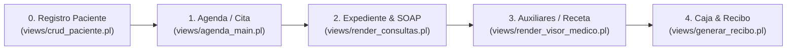

# Flujo Global de Atención Médica y Consultas SOAP Polimórficas

## 1. Pipeline Unificado de Atención Médica

```mermaid
graph LR
    Paso0["0. Registro Paciente<br/>(views/crud_paciente.pl)"] --> Paso1["1. Agenda / Cita<br/>(views/agenda_main.pl)"]
    Paso1 --> Paso2["2. Expediente & SOAP<br/>(views/render_consultas.pl)"]
    Paso2 --> Paso3["3. Auxiliares / Receta<br/>(views/render_visor_medico.pl)"]
    Paso3 --> Paso4["4. Caja & Recibo<br/>(views/generar_recibo.pl)"]
```

---

## 2. Descripción de las Etapas de Atención

1. **Recepción y Registro**: Alta de datos de identificación, cálculo automático de edad y apertura de expediente.
2. **Agendamiento**: Asignación de turno, horario, especialidad y médico tratante.
3. **Atención Médica SOAP**: Registro de signos vitales, exploración física y nota clínica.
4. **Auxiliares y Medicamentos**: Emisión de recetas y consulta PACS de laboratorio/imagenología.
5. **Cierre y Caja**: Emisión del recibo de cobro en ventanilla en **Caja Rápida**.

---

## 3. Las 3 Reglas de Oro de Arquitectura SOAP Polimórfica

1. **Contrato de Datos JSON SOAP Canónico**:
   Toda consulta clínica privada debe serializarse en `dat/consultas_clinicas.dat` bajo las 4 llaves principales:
   - **`subjective`**: Anamnesis, motivo de consulta y padecimiento actual.
   - **`objective`**: Signos vitales universales (`TA`, `FC`, `FR`, `Temp`, `Peso`, `Talla`, `IMC`, `SpO2`) y subformulario del especialista (`soap.objective.especialidad_data`).
   - **`assessment`**: Diagnóstico principal CIE-10, diagnósticos secundarios e impresión clínica.
   - **`plan`**: Plan terapéutico, indicaciones, prescripciones y órdenes auxiliares.
2. **Core Pipeline Único (80% compartido)**:
   Existe un solo wizard principal (`render_consultas_privado.pl`). Está **estrictamente prohibido duplicar vistas por especialidad** (no crear `consulta_pediatria.pl` ni `consulta_ginecologia.pl`).
3. **Subformularios Desacoplados (Plugin Slot 20% dinámico)**:
   Los componentes por especialidad residen en `views/partials/consultas/` o `views/partials/especialidades/`. Si una especialidad aún no cuenta con subformulario nativo, se renderiza el Módulo Fallback Universal con signos vitales.

---

## 4. Innovaciones Técnicas y Mecanismos de Control

### 4.1 Restricción Estricta de Consulta Única Activa por Médico
- Un médico no puede mantener 2 consultas abiertas simultáneamente.
- `render_consultas_privado.pl` analiza `citas.dat`. Si el facultativo posee una cita previa en estado `En consulta`, bloquea la navegación desplegando una alerta SweetAlert2 que exige finalizar la consulta previa.

### 4.2 Trazabilidad de Consulta Activa en Expediente
- En `render_expediente_clinico.pl`, cuando una cita está `En consulta`, el botón del timeline cambia a **`Continuar con la consulta ▶`** (`btn-info text-white`).
- En el modal resumen del directorio de pacientes (`pacientes.pl`), se despliega el badge **`En Consulta`** con enlace directo a la sesión activa.

### 4.3 Grid Responsivo de 4 Columnas
- En `step_registro_privado.pl`, los formularios se estructuran bajo `col-12 col-md-3` (4 columnas simétricas en escritorio/tablet y 1 columna en móvil).

### 4.4 Trazabilidad de Tratamientos Abiertos y Cargos Directos
- **Seguimiento Activo**: Si el paciente posee un tratamiento abierto en `dat/tratamientos.dat`, el Paso 0 inyecta automáticamente el `id_tratamiento` bloqueando el tipo a *Seguimiento* y calculando el balance histórico en `estado_cuenta.dat`.
- **Cargos Directos (`modalCargoConsultas`)**: Permite agregar servicios/medicamentos adicionales durante la consulta en memoria. Al confirmar, serializa en `caja_items_json` para que `cerrar_consulta_privado.pl` genere o anexe los cargos a la orden de servicio.

### 4.5 Solución al Conflicto de Apilamiento (Backdrop Trap)
- Modales anidados (`modalCargoConsultas`, `modalCita`) ejecutan `document.body.appendChild(modalEl)` al abrirse para renderizarse fuera del contenedor del wizard y evitar quedar atrapados tras el telón oscuro de Bootstrap (`.modal-backdrop`).

### 4.6 Hub PACS e Integración de Estudios Complementarios
- En `step_estudios.pl`, se consulta `dat/estudios.dat` por paciente. Muestra miniaturas de previsualización (`.jpg`, `.png`), enlace directo al Visor DICOM (`render_visor_medico.pl`) y switch de asignación para concatenar la descripción del estudio en las notas del informe.

### 4.7 Sincronización Temporal al Momento Real y Trazabilidad de Citas
- **Principio de Veracidad y Cronología Real (NOM-004-SSA3)**: Al tomar una cita médica desde la agenda (sea una cita extemporánea del pasado, del presente o reagendada), el sistema asume que el acto médico ocurre en tiempo presente. En consecuencia, el wizard clínico (`render_consultas_privado.pl` y `render_consultas.pl`) sincroniza automáticamente `fecha_consulta` y `hora_consulta` al día y hora actuales (`$hoy_fecha`, `$hoy_hora`), proyectando la hora de término calculada.
- **Sincronización en `dat/citas.dat`**: La cita actualiza su fecha (`col 3`) y hora de inicio (`col 4`) al momento real de atención, fijando su estado en `En consulta`.
- **Bitácora de Trazabilidad en Notas**: Para no perder el registro de la programación original, el sistema concatena automáticamente una marca de auditoría en el campo de notas (`col 7`): `[Atencion: YYYY-MM-DD HH:MM (Prog. original: YYYY-MM-DD HH:MM)]`.
- **Cierre Integral y Cuadre de Caja**: Al finalizar la consulta en `api/cerrar_consulta_privado.pl` o `api/cerrar_consulta.pl`, la cita se sella de forma inmutable como `Atendida` en la fecha real, cuadrando al 100% con los recibos de caja, recetas médicas y consentimientos informados emitidos en esa misma jornada.

### 4.8 Integración de Odontogramas Clínicos y Rayos X (PACS) en Consulta y Detalle
- **Paso 3 Exploración Física (`step_exploracion.pl`)**: Integra la tabla interactiva `#tablaConsultaOdontogramas` (con 6 columnas: `Asignar`, `Preview`, `Fecha`, `Estado`, `Descripción / Alias` y `Acciones`), permitiendo seleccionar y anexar hallazgos odontológicos previos directamente en el campo de texto de hallazgos mediante un toggle switch reactivo (`toggleOdontoToExploracion`).
- **Jerarquización en Odontología y Retiro de Subformulario Legacy**: Para la especialidad Odontología (`$is_odontologia`), se retiró el antiguo subformulario de 6 botones y su script desactualizado (`odontograma_spa.js`). La tabla de Odontogramas Clínicos Disponibles asume el rol protagónico en la exploración objetiva, acompañada del botón de acción rápida **`+ Nuevo Odontograma`** (enlazado directamente al Visor Odontograma Pro `views/render_visor_odontograma.pl`) y el botón **`Evolución`** para generar nuevas versiones clínicas preservando el diagnóstico base.
- **Segregación Polimórfica en Especialidades No Odontológicas**: Para especialidades distintas a odontología, se mantiene el encabezado "Exploración Dirigida por Especialidad" con su slot modular desacoplado (`#especialidad-subformulario-container`), evitando desplegar tablas o advertencias odontológicas innecesarias.
- **Persistencia Multi-Selección (`api/cerrar_consulta_privado.pl` y `api/cerrar_consulta.pl`)**: Almacenamiento dinámico como `ARRAY` o escalar para `odonto_estudios_seleccionados` y `pacs_estudios_seleccionados` dentro del payload JSON en `dat/consultas_clinicas.dat`.
- **Despliegue Dinámico en `views/consulta_detalles.pl`**: Si se asignaron odontogramas o estudios de rayos X / PACS durante la consulta (detectados por ID en payload o por marcas canónicas en el texto clínico), se renderizan bloques visuales estructurados dentro de la tarjeta Bento de **Exploración Física (Paso 3)** con miniaturas, badges de estado/modalidad, desglose de piezas/presupuesto y enlaces directos a sus visores especializados (`render_visor_odontograma.pl` y `render_visor_medico.pl`).

### 4.9 Evolución Clínica, Inyección en Caja y Finalización de Odontogramas (Especialidad Odontología)
- **Clonación Atómica para Evolución Clínica ("Antes y Después")**: En el Paso 3 (`step_exploracion.pl`), si el médico tratante es de especialidad Odontología (`$is_odontologia`), la tabla de odontogramas expone el botón de acción **`Evolución`** (`crearEvolucionOdonto`). Al pulsarlo, `api/odontograma_api.pl?accion=clone` duplica de forma profunda el estado de piezas, superficies y periodontograma bajo el alias `Evolución - DD/MM/YYYY HH:MM` con estado `En Proceso`. Esto permite al odontólogo documentar los procedimientos y tratamientos efectuados en la sesión sin corromper el diagnóstico basal inicial.
- **Inyección Automática a Conceptos a Cobrar (Paso 6 `step_caja_privado.pl`)**: Cuando la consulta corresponde a Odontología, se despliega el banner `#caja-odonto-banner` que detecta el odontograma asignado en el Paso 3. A través de `api/odontograma_api.pl?accion=get_treatments`, desglosa los tratamientos presupuestados y los inyecta en el carrito de cargos (`carritoConsulta` y `caja_items_json`), recalculando en tiempo real los totales, abonos y destino del tratamiento.
- **Sello y Finalización Automática de Odontograma (`api/cerrar_consulta_privado.pl`)**: Al finalizar y cerrar la consulta, el backend evalúa el switch `odonto_finalizar_al_cerrar` o la especialidad odontológica, actualizando concurrentemente con `flock` el odontograma asignado a estado `Finalizado` con timestamp tanto en `dat/odontogramas/paciente_[id].json` como en `dat/odontogramas.dat`.

### 4.10 Módulo Universal de Dictado Clínico por Voz (Speech-to-Text) y Limpieza de Campos
- **Cobertura en Wizard Clínico**: 
  - **Paso 2 Anamnesis (`step_anamnesis.pl`)**: Toolbar con micrófono (`#btn-dictado-evolucion`) y botón de borrador/limpieza rápida en el campo obligatorio **"Evolución y Síntomas"**.
  - **Paso 3 Exploración Física (`step_exploracion.pl`)**: Toolbar con micrófono (`#btn-dictado-hallazgos`) y botón de limpieza rápida en el campo obligatorio **"Hallazgos Clínicos"**.
- **Arquitectura Universal y Reutilizable para N Campos (`js/dictado_voz.js`)**: 
  - El motor `window.toggleDictadoVoz(targetSelector, btnElement)` está desacoplado para operar sobre cualquier selector CSS o elemento `textarea` / `input` presente o futuro del sistema.
  - Resolución contextual de indicadores de feedback visual (`.dictado-live-badge`) sin requerir IDs rígidos.
  - Reconocimiento continuo nativo con Web Speech API en español (`es-MX`) y transcripción fluida en tiempo real (`interimResults`).
- **Botón Universal de Limpieza Segura (`limpiarCampoTexto`)**:
  - Función global `window.limpiarCampoTexto(targetSelector)` que resetea el valor, enfoca el control y despacha automáticamente los eventos reactivos `input` y `change` para sincronización con `autosave.js` y validación de obligatoriedad.
  - Incorpora confirmación preventiva SweetAlert2 cuando el texto supera 25 caracteres para evitar borrados accidentales de notas clínicas extensas.

