# Flujo Operativo, Reglas de Negocio y UX de Caja Rápida (`views/generar_recibo.pl`)

## 1. Visión General
El módulo de **Caja Rápida** (`views/generar_recibo.pl`) administra la emisión ágil e integral de recibos de cobro para dos canales principales:
1. **Pacientes Privados** (`pacienteTipoActual === 'privado'`): Cobro directo en ventanilla con recibo comercial privado foliado.
2. **Pacientes de Convenio / Estado / Municipio** (`pacienteTipoActual === 'estado'`): Órdenes médicas amparadas bajo subsidio público/municipal con recibo público foliado y liquidación vía Cuentas por Cobrar (CXC Estado).

---

## 2. Reglas de Negocio en la Interfaz (UX)

### 2.1 Ordenamiento Alfabético de Departamentos y Preselección
- El selector de departamento en la cabecera carga la lista de departamentos activos ordenados **estrictamente de forma alfabética**.
- Por defecto, el departamento **`CONSULTAS`** (`id_dep = 1`) se preselecciona automáticamente, activando de inmediato la cascada clínica (Especialidad y Médico Tratante).

### 2.2 Cascadas Dinámicas y Tarifa Activa por Tipo de Paciente
- **Paciente Privado**: Se evalúan médicos y especialidades cuyas tarifas comerciales (`ESTANDAR` u otras distintas a `MUNICIPIO`) sean **mayores a $0.00**. Se excluyen especialidades de tarifa $0.00 reservadas para convenio.
- **Paciente Convenio / Municipio**: Se filtran únicamente los facultativos con tarifa `MUNICIPIO` **mayor a $0.00** definida en el tabulador municipal.

### 2.3 Arquitectura Multi-Tarifa en Conceptos Adicionales
Para servicios adicionales (Imagenología, Laboratorios, Urgencias, Curaciones, Paquetes, etc.):
1. **Exclusión de Departamento Consultas**: El modal de búsqueda del carrito omite automáticamente los ítems pertenecientes al departamento `CONSULTAS` (`id_dep = 1`) para evitar duplicar el flujo clínico.
2. **Selector de Tarifa en la Tabla Modal**: Si un servicio posee múltiples tarifas comerciales activas para el tipo de paciente (ej. `ESTÁNDAR`, `URGENCIAS`, `DOMINGOS Y FESTIVOS`), la columna de precio renderiza un selector `<select id="selTarifaModal_${id}">`. Si solo cuenta con 1 tarifa, muestra la cifra estática.
3. **Conmutación en Borrador Modal**: Al agregar el concepto al modal (`agregarAlCarritoModalRecibo`), se captura la tarifa seleccionada. La lista previa permite cambiar de tarifa antes de confirmar.
4. **Conmutación Dinámica en Carrito Principal**: En `renderCart()`, los ítems agregados con múltiples tarifas desplegadas incluyen un selector `<select>` integrado en su tarjeta (`.cart-item-card`). La función `updateCartItemTarifa(idx, elem)` actualiza en tiempo real:
   - Precio unitario del concepto.
   - Subtotal del ítem.
   - Retención / Desglose de IVA (16% si está marcado `#chkIva`).
   - **TOTAL A PAGAR** del recibo.

---

## 3. Estándares UI/UX y Responsividad Táctil

1. **Contenedor Flexible del Carrito (Solución a Espacios Vacíos)**:
   - El recuadro del carrito utiliza estilos flexibles adaptables (`flex: 1 1 auto; min-height: 100px; max-height: 420px; overflow-y: auto;`).
   - Crece orgánicamente con cada concepto agregado y activa un scrollbar discreto solo al sobrepasar la altura máxima.
2. **Alineación Vertical Impecable al Píxel Derecho**:
   - Homologación de márgenes en `#cartContainer` y tarjetas `.cart-item-card`.
   - Precios unitarios, desgloses, IVA, monto Total a Pagar y botón de emisión coinciden en un eje vertical derecho 100% simétrico.
3. **Usabilidad Móvil (Touch Targets)**:
   - Botones de acción adaptados con `.btn-mobile-standard` garantizando área táctil mínima de 48px.

---

## 4. Diagrama del Procesamiento del Recibo

```mermaid
graph TD
    A["Inicio Caja Rápida"] --> B{"Tipo Paciente"}
    B -- "Privado" --> C["Filtrar Tarifas Comerciales > $0.00"]
    B -- "Estado / Municipio" --> D["Filtrar Tabulador MUNICIPIO > $0.00"]
    C --> E["Seleccionar Consulta / Facultativo"]
    D --> E
    E --> F["Agregar Conceptos Adicionales (Modal Búsqueda)"]
    F --> G{"Concepto posee Multi-Tarifa?"}
    G -- "Sí" --> H["Desplegar Selector <select> de Tarifa Activa"]
    G -- "No" --> I["Cargar Tarifa Base Única"]
    H --> J["Confirmar en Carrito (.cart-item-card)"]
    I --> J
    J --> K["Conmutar Tarifa en Vivo / Recalcular IVA y Total"]
    K --> L["Emitir Recibo (Vista Previa Pestaña Controlada)"]
```

