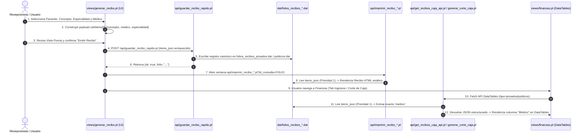

# Protocolo Unificado de Impresión Controlada y Generación de Recibos

## 1. Visión General
Este documento reúne las normas, especificaciones de interfaz y reglas contables para la generación e impresión de **Recibos Privados** y **Recibos Públicos / Convenios** emitidos desde Caja Rápida o los módulos de cobranza del sistema.

---

## 2. Reglas Generales de Impresión Controlada

### 2.1 Erradicación del Auto-Disparo (`onload`) y Cierre Forzado
- **Comportamiento Canónico**: Todo recibo se despliega en una nueva pestaña del navegador como una vista estática e inspeccionable.
- **Prohibición**: Queda prohibido inyectar `onload="window.print()"` o funciones `afterprint` que fuercen el cuadro de diálogo inmediatamente o cierren la ventana al imprimir o cancelar.

### 2.2 Barra de Herramientas Interactiva (`.no-print`)
Todo recibo incluye una barra superior de acciones visible únicamente en pantalla:
1. **`🖨️ Imprimir Recibo`**: Ejecuta `window.print()` manualmente solo cuando el usuario lo decide.
2. **`← Volver / Cerrar`**: Dispara la función `volverPadre()`.
   - Si la ventana fue abierta como emergente/pestaña (`window.opener`), enfoca la ventana principal (`generar_recibo.pl`) y cierra la pestaña actual (`window.close()`).
   - Si se navegó directamente, ejecuta retorno en el historial (`history.back()`).

### 2.3 Regla CSS para Medios Impresos
```css
@media print {
    .no-print {
        display: none !important;
    }
}
```

---

## 3. Especificaciones por Tipo de Recibo

### 3.1 Recibo Privado (`api/imprimir_recibo_caja.pl`)
- **Naturaleza**: Cobro comercial directo en ventanilla a Pacientes Privados.
- **Fuente Canónica**: Inserción única en `dat/folios_recibos_privados.dat`.
- **Efectivo Real**: Representa ingreso físico de caja en efectivo, tarjeta o transferencia.
- **Contenido**: Folio consecutivo, desglose de IVA (16%), sello/firma del cajero y lista detallada de conceptos con su tarifa aplicada.

### 3.2 Recibo Público / Convenio (`api/imprimir_recibo_publico.pl`)
- **Naturaleza**: Orden de atención médica amparada bajo convenio gubernamental/municipal con subsidio.
- **Fuente Canónica**: Inserción en `dat/folios_recibos_publicos.dat`.
- **Contabilidad CXC Estado**: **NO constituye ingreso de efectivo físico en caja**. Se computa como Cuentas por Cobrar (CXC Estado) hasta su cobro institucional.

---

### 3.3 Jerarquía Unificada de Resolución de Médico y Especialidad en Impresión (`api/imprimir_recibo_caja.pl` y `api/imprimir_recibo_publico.pl`)
Para garantizar la exactitud entre lo seleccionado en la vista previa ([views/generar_recibo.pl](file:///c:/xampp/htdocs/ospulso/views/generar_recibo.pl)) y la impresión final (privada o pública/municipio), la resolución del médico y la especialidad se rige strictly por la siguiente jerarquía unificada:
1. **Preservación Directa del Payload (`items_json` / `@cargos`)**: Prioridad absoluta. Se extrae `medico`, `nombre_medico` y `especialidad` directamente de los objetos guardados en `items_json`. Esto asegura que el médico y especialidad seleccionados en la UI viajen intactos sin distorsiones ni búsquedas heurísticas.
2. **Match por Ítem de Catálogo (`catalogo_items_${clues}.dat`)**: Si no viene explícito en el JSON pero `$id_medico` coincide con un `ID_ITEM` del catálogo de caja rápida (ej. `CONSULTA PEDIATRIA - DRA ROSA MARIA GONZALEZ`), se extrae la especialidad (`PEDIATRIA`) y el médico (`DRA ROSA MARIA GONZALEZ`) de la descripción del catálogo.
3. **Plantilla de Médicos (`medicos_${clues}.dat`)**: Aplica para citas agendadas directamente en la Agenda Médica donde `$id_medico` es la clave del médico de la sucursal.
4. **Fallback General**: Consulta en `usuarios.dat` o asignación de `"NO ESPECIFICADO"`.
5. **Formateo Estándar de la Tabla**: El renglón de la tabla imprime `"Consulta - <ESPECIALIDAD>"` y omite repetir el nombre del médico en la descripción del concepto, presentándolo limpiamente únicamente en la fila `"Médico:"` del encabezado.

---

## 4. Flujo de Datos End-to-End (Emisión → Persistencia → Impresión y DataTables)

### 4.1 Diagrama de Secuencia de Arquitectura



### 4.2 Descripción de Etapas del Pipeline

1. **Captura y Enriquecimiento de Atributos (UI Frontend)**:
   - En `views/generar_recibo.pl`, al seleccionar un médico (`#selMedico`) y especialidad (`#selEspecialidadCustom`), se genera en `cartItems[0]` la llave explícita `medico` / `nombre_medico` y `especialidad`.
   - Si el carrito estaba vacío al emitir para un empleado de estado, la función `emitirReciboFinal()` inyecta automáticamente el concepto en formato `Consulta - <ESPECIALIDAD>` con los campos `medico` y `especialidad` limpios.

2. **Persistencia Contable Canónica (Backend)**:
   - `api/guardar_recibo_rapido.pl` asigna el folio consecutivo correspondiente y serializa el arreglo `cartItems` en la columna `ITEMS_JSON` dentro de `dat/folios_recibos_privados.dat` (pacientes privados) o `dat/folios_recibos_publicos.dat` (municipio / convenio).

3. **Impresión Controlada Estática**:
   - `api/imprimir_recibo_caja.pl` y `api/imprimir_recibo_publico.pl` leen la fila por folio, decodifican `ITEMS_JSON` y aplican la **Prioridad 1**: leen directamente los atributos `medico` y `especialidad` guardados en el JSON.

4. **Sincronización con Módulos Financieros (DataTables)**:
   - `api/get_recibos_caja_api.pl` (para tabs **Ingresos**, **CxC Privadas**, **CxC Estado**) y `api/generar_corte_caja.pl` (para tab **Corte de Caja**) leen `ITEMS_JSON` aplicando la **Prioridad 1**, garantizando que la columna **Médico** de DataTables coincida exactamente con la vista previa y el recibo impreso.
