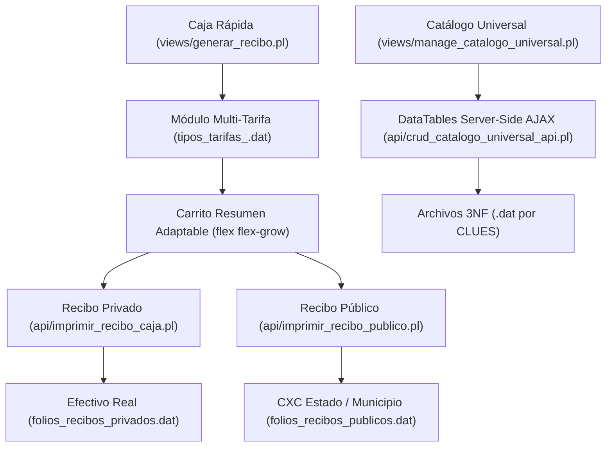

# Documentación Maestra del Sistema OSPulso / SDM 2.0

## 1. Índice General de Documentación

Esta Documentación Maestra sirve como mapa centralizado para todos los aspectos de arquitectura, diseño de base de datos 3NF, reglas de negocio, flujos financieros y normatividad del sistema.

### 📚 Arquitectura y Base de Datos
- **[DICCIONARIO_DATOS_SDM.md](file:///c:/xampp/htdocs/ospulso/docs/DICCIONARIO_DATOS_SDM.md)**: Especificación técnica detallada de la estructura de archivos `.dat`, campos, llaves y tipos de datos por tenant.
- **[modulo_gestion_catalogos.md](file:///c:/xampp/htdocs/ospulso/docs/modulo_gestion_catalogos.md)**: Arquitectura del Catálogo Universal 3NF, DataTables Server-Side AJAX (`deferRender: true`), paginación por defecto (10 registros) y normalización por CLUE.

### 💰 Finanzas, Caja y Cobranza
- **[ARQUITECTURA_FINANCIERA_TENANT.md](file:///c:/xampp/htdocs/ospulso/docs/ARQUITECTURA_FINANCIERA_TENANT.md)**: Fuente Canónica de Verdad para ingresos, segregación de Efectivo Real vs Cuentas por Cobrar (CXC Estado) e integridad contable al centavo.
- **[flujo_caja_rapida.md](file:///c:/xampp/htdocs/ospulso/docs/flujo_caja_rapida.md)**: Proceso operativo de Caja Rápida, arquitectura Multi-Tarifa dinámica en conceptos y estándares UI/UX del carrito.
- **[impresion_recibo_caja.md](file:///c:/xampp/htdocs/ospulso/docs/impresion_recibo_caja.md)**: Protocolo de impresión controlada de Recibos Privados con Toolbar `.no-print`.
- **[impresion_recibo_publico.md](file:///c:/xampp/htdocs/ospulso/docs/impresion_recibo_publico.md)**: Protocolo de impresión controlada de Recibos Públicos / Convenio Municipal.

### ⚙️ Reglas de Negocio y Estándares
- **[REGLAS_NEGOCIO.md](file:///c:/xampp/htdocs/ospulso/docs/REGLAS_NEGOCIO.md)**: Compendio global de reglas de negocio SOAP, catálogos, impresión, gobernanza RBAC y estándares de codificación Perl/JS.

---

## 2. Diagrama de la Arquitectura Global

