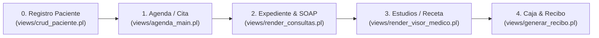

# Flujo Global de Atención Médica: Roles y Componentes

## 1. Pipeline Unificado de Atención Médica

---

## 2. Descripción de Etapas

1. **Recepción y Agenda**: Registro de datos de identificación y asignación de turno/médico en agenda.
2. **Atención Médica SOAP**: Captura de historia clínica, signos vitales y nota SOAP polimórfica.
3. **Estudios y Auxiliares**: Solicitud de laboratorio o imagenología cargados directamente al estado de cuenta o cobrados en caja.
4. **Cierre y Recibo**: Cobro en ventanilla en **Caja Rápida**, selección de tarifas y emisión de recibo foliado.
