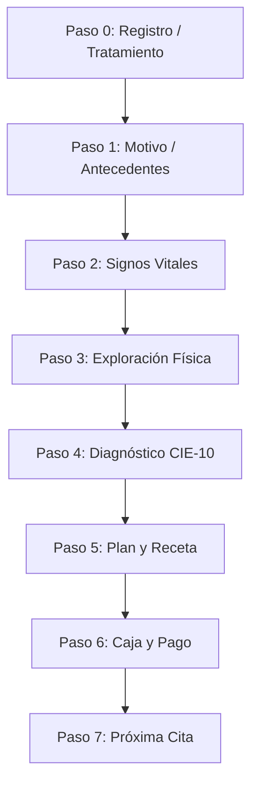

# Análisis de Implementación: Flujo de Consulta Privada (`render_consultas_privado.pl`)

Este documento presenta el análisis técnico y funcional de la implementación del nuevo flujo de consultas para organizaciones de naturaleza jurídica **Privado**, estructurado bajo el wizard de 8 pasos.

---

## 1. Contexto y Objetivos

El sistema heredado de OSPulso operaba un flujo de consulta clínico unificado que no distinguía entre clínicas de salud pública y clínicas privadas. En organizaciones de naturaleza privada, el flujo clínico está intrínsecamente ligado al flujo financiero (caja, presupuestos, cobros e historial de cuentas).

### Objetivos de la Implementación:
1. **Separación de Flujos**: Mantener el flujo tradicional en `render_consultas.pl` y redireccionar dinámicamente a clínicas privadas al nuevo wizard en **[render_consultas_privado.pl](file:///c:/xampp/htdocs/ospulso/views/render_consultas_privado.pl)**.
2. **Estructura en 8 Pasos**: Guiar al médico a través de un proceso secuencial e intuitivo que cubre desde la recepción inicial hasta el cobro y la programación de la cita de seguimiento.
3. **Trazabilidad Financiera**: Conectar el expediente clínico con el estado de cuenta del paciente, permitiendo registrar abonos y cargos directos o presupuestados.
4. **Seguimiento de Tratamientos**: Detectar automáticamente tratamientos activos en curso para evitar duplicidad de cobros y forzar consultas de tipo "Seguimiento".

---

## 2. Arquitectura del Wizard de 8 Pasos

El flujo se implementó como un formulario dinámico gobernado por pasos (`Step 0` a `Step 7`) administrados en el frontend por `js/consulta_flow_privado.js`.

### Detalle de los Pasos:

| Paso | Nombre | Componente / Script Relacionado | Descripción |
| :--- | :--- | :--- | :--- |
| **Paso 0** | Registro Inicial | **[step_registro_privado.pl](file:///c:/xampp/htdocs/ospulso/views/partials/consultas/step_registro_privado.pl)** | Identificación del paciente, cálculo automático de Edad, fecha/hora de consulta, vinculación de motivo de cita, actualización de estado a `En consulta` y gestión de tratamiento/cotización. |
| **Paso 1** | Motivo y Antecedentes | `step_motivo.pl` | Notas subjetivas de consulta y actualización de antecedentes del paciente. |
| **Paso 2** | Signos Vitales | `step_signos.pl` | Registro cuantitativo (presión, temperatura, IMC con cálculo automático). |
| **Paso 3** | Exploración Física | `step_exploracion.pl` | Notas objetivas y examen físico general. |
| **Paso 4** | Diagnóstico | `step_diagnostico.pl` | Diagnósticos y pre-diagnósticos vinculados a catálogo CIE-10. |
| **Paso 5** | Plan y Receta | `step_plan.pl` | Indicaciones clínicas y emisión de recetas médicas. |
| **Paso 6** | Caja / Estado de Cuenta | **[step_caja_privado.pl](file:///c:/xampp/htdocs/ospulso/views/partials/consultas/step_caja_privado.pl)** | Gestión financiera (abonos de tratamientos, cargos adicionales, cálculo de saldos). |
| **Paso 7** | Próxima Cita | `step_cita.pl` | Programación del seguimiento clínico, conectada a la agenda SPA. |

---

## 3. Vinculación de Citas, Estados de Agenda, Hora Real, Regla de Consulta Única y UI 4-Columnas

### A. Vinculación de Fecha, Hora Real y Motivo de Cita
- **Cita Previa ($id_cita)**: Al abrir la consulta privada vinculada a una cita existente, se carga la `fecha` agendada y la `hora_ini` se **actualiza dinámicamente con la hora real** en que el médico toma la atención (`localtime` en formato `HH:MM`), guardándose tanto en pantalla como en `citas.dat`. Se precarga el `motivo` exacto registrado en la cita.
- **Sin Cita / Consulta Express**: Si la consulta no tiene cita agendada, la fecha y la hora se inicializan con el momento real de inicio (`localtime`), y el motivo de consulta inicia en blanco.

### B. Restricción Estricta de Consulta Única Activa por Médico
- **Regla Clínica**: Un médico no puede mantener 2 consultas activas en paralelo.
- **Validación en Backend**: Al intentar abrir una consulta (`render_consultas_privado.pl`), el backend analiza `citas.dat`. Si el médico (`$id_medico`) ya posee una cita en estado **`En consulta`** diferente a la que intenta abrir, se bloquea la navegación desplegando una alerta modal (SweetAlert2) que le exige finalizar la consulta activa antes de iniciar otra.

### C. Visualización del Estado "En Consulta" en el Modal Resumen del Paciente
- En el modal "Resumen de Expediente" del listado de pacientes (`pacientes.pl` y `pacientes_spa.js`), el estado de las citas en curso se renderiza con un badge **`En Consulta`** (`bg-info text-white`) y un botón interactivo *"Ir a Consulta Activa"*.

### D. Refactorización Responsiva del Grid (4 Columnas en Desktop/Tablet)
- El formulario en [step_registro_privado.pl](file:///c:/xampp/htdocs/ospulso/views/partials/consultas/step_registro_privado.pl) fue estructurado bajo un grid responsivo estricto:
  - **Tabletas y Pantallas Mayores (`≥ 768px`)**: Filas simétricas de **4 columnas idénticas** (`col-12 col-md-3`) eliminando espacios en blanco o desalineaciones.
  - **Dispositivos Móviles (`< 768px`)**: Colapso automático a **1 sola columna** (`col-12`).

### E. Cálculo Automático de Edad
- Se extrae `FECHA_NAC` de `dat/pacientes.dat` (Columna índice 6) y se calcula la edad en años mediante `calcular_edad($fecha_nac)`, desplegándose a un lado de **Sexo**.

---

## 4. Innovaciones y Mecanismos Técnicos Clave

### A. Trazabilidad de Tratamientos Abiertos (Seguimiento Continuo)
Para evitar la duplicidad de cobros y asegurar la consistencia del libro mayor (`dat/estado_cuenta.dat`), el sistema realiza las siguientes validaciones:
1. **Detección Activa**: En el Paso 0, el script lee `dat/tratamientos.dat`. Si el paciente tiene un tratamiento con `Estado = Abierto`, se bloquea el selector de cotizaciones y se inyecta el `id_tratamiento` actual.
2. **Forzado de Tipo**: Se bloquea la opción "Tipo de Consulta" a **Seguimiento**.
3. **Carga de Historial en Caja**: Caja detecta el tratamiento activo y calcula el balance actual leyendo todos los cargos y abonos históricos de dicho tratamiento en `estado_cuenta.dat`. El médico visualiza el saldo real pendiente de liquidar.
4. **Validación de Citas**: Si el tratamiento se mantiene "Abierto" al cerrar la consulta, el sistema obliga al médico a agendar la próxima cita de seguimiento (Paso 7).

### B. Carrito Local e Integración de Orden de Servicio ("Cargos Directos")
Para cubrir casos donde no existe una cotización formal previa o se requieren cargos adicionales inmediatos (como la venta de un medicamento en stock o el costo de la consulta de valoración):
- **Modal de Cargos**: Se clonó e integró la interfaz de "Nueva Orden de Servicio" (`modalCargoConsultas`) en el Paso 6.
- **Catálogo Conectado**: El modal consume `/api/estado_cuenta_api.pl?accion=get_catalogo` para permitir la búsqueda de productos y servicios vigentes.
- **Carrito en Memoria**: El JS gestiona localmente las altas, bajas y modificaciones de cantidad del carrito.
- **Serialización**: Al confirmar, los cargos directos se reflejan en el desglose de Caja y se serializan como JSON en el campo oculto `caja_items_json`.
- **Backend Adaptativo ([cerrar_consulta_privado.pl](file:///c:/xampp/htdocs/ospulso/api/cerrar_consulta_privado.pl))**:
  - Si hay cargos directos pero no hay tratamiento previo, autogenera una nueva Orden de Servicio (`TX-...`) en `tratamientos.dat` y guarda los registros como `Cargo` en `estado_cuenta.dat`.
  - Si hay un tratamiento activo existente, anexa los nuevos conceptos como `Cargo` adicionales al mismo tratamiento.

### C. Solución al Conflicto de Apilamiento (Backdrop Trap)
Durante el renderizado del wizard, los modales anidados (`modalCargoConsultas` y `modalCita`) quedaban atrapados debajo de la capa oscura de Bootstrap (`.modal-backdrop`), inhabilitando la interacción.
- **Solución implementada**: Al dispararse las funciones de apertura (`abrirModalCargoConsultas` y `abrirModalCitaConsulta`), se valida si el nodo contenedor está fuera de `document.body`. En caso afirmativo, se ejecuta `document.body.appendChild(modalEl)` para moverlo a la raíz del DOM, rompiendo el contexto de apilamiento local del wizard.

### D. Integración PACS en Estudios Complementarios y Mapeo Dental UTF-8
Para optimizar el flujo clínico de imagenología y el diagnóstico odontológico dentro del wizard de consulta:
1. **Rejilla Unificada de Odontograma**: Se reestructuró la botonera de herramientas del Odontograma interactivo (Paso 2, `step_exploracion.pl`) bajo una cuadrícula responsiva CSS Grid `.odontograma-tools-grid` que garantiza un ancho idéntico en todos los botones de herramienta.
2. **UTF-8 en Vistas**: Se sanitizaron y reemplazaron acentos y caracteres especiales con codificación segura de entidades HTML (`Extracci&oacute;n`, `Pr&oacute;tesis`, `B&aacute;sicos`) para evitar fallos de renderizado de texto en el motor del navegador/WebView.
3. **Hub PACS e Integración Automática (Paso 3, `step_estudios.pl`)**:
   - El componente de **Estudios Complementarios** consulta dinámicamente el archivo `dat/estudios.dat` filtrando por el ID de paciente.
   - Si no existen registros, despliega una alerta informativa unificada indicando que no hay estudios de gabinete previos.
   - Si existen estudios, renderiza una DataTable responsiva que muestra la fecha, modalidad (XR, CT, MR) y descripción de los estudios PACS.
   - **Vista Previa de Imagen**: Para estudios con ruta de imagen compatible (`.jpg`, `.png`, `.webp`, `.gif`), carga una miniatura rápida de previsualización directamente en la tabla.
   - **Enlace de Visor Médico**: Incluye un disparador directo que abre en pestaña nueva el Visor DICOM (`render_visor_medico.pl`) cargado en el expediente clínico del paciente.
   - **Check de Asignación por JS**: Permite asociar estudios de rayos X a la consulta actual. Al marcar el switch, el sistema concatena automáticamente la descripción detallada del estudio en el área de texto clínico de `gabinete_solicitados` (ej. `[Estudio PACS - XR - 19/07/2026 - Radiografía Dental]`).

---

## 4. Estabilidad y Normativa de Código (Error 500 Guard)

Para garantizar la estabilidad del ecosistema OSPulso y evitar caídas en el servidor Apache:
- **Escape de Símbolos en Bloques Interpolados**: Todo símbolo `@` inyectado en bloques `qq{...}` o heredocs (como en selectores CSS o eventos `@media`) fue escapado como `\@` para prevenir que el compilador Perl lo interprete como un arreglo inexistente.
- **Control de Rutas**: Uso obligatorio de `FindBin` para resolver directorios de bases de datos planas (`.dat`).
- **Codificación e Integrity**: UTF-8 estricto en todos los archivos con terminaciones de línea en formato LF.
