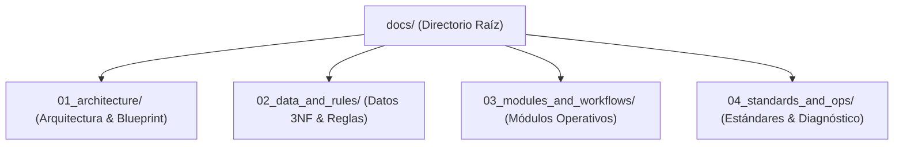
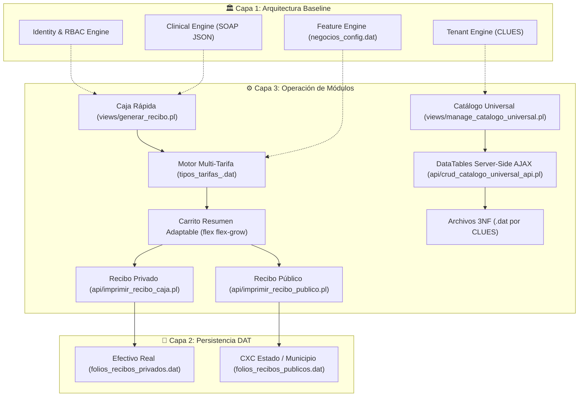

# Mapa Maestro de Documentación del Sistema OSPulso / SDM 2.0

Bienvenido a la Documentación Oficial de **OSPulso / SDM 2.0**. Este repositorio documental está estructurado bajo la **Metodología de 4 Capas Temáticas** para ofrecer una fuente de verdad única, libre de duplicidades y de fácil navegación.

---

## 🗺️ Mapa de Navegación por Capas Temáticas

---

### 🏛️ Capa 1: Arquitectura, Blueprint y Filosofía (`docs/01_architecture/`)
- **[01_medentos_core_architecture.md](file:///c:/xampp/htdocs/ospulso/docs/01_architecture/01_medentos_core_architecture.md)**: Manifiesto infraestructural y reglas globales (`Const-001` a `Const-004`) de la plataforma SaaS multitenant (MedentOS Core Architecture).
- **[02_ospulso_master_blueprint.md](file:///c:/xampp/htdocs/ospulso/docs/01_architecture/02_ospulso_master_blueprint.md)**: Blueprint estratégico de producto, modelo de negocio para directores clínicos y sistema UI/UX.
- **[03_ospulso_master_specification.md](file:///c:/xampp/htdocs/ospulso/docs/01_architecture/03_ospulso_master_specification.md)**: Constitución técnica del ecosistema OSPulso / SDM, motor Multi-Tarifa, DataTables Server-Side y definición de hecho.

### 💾 Capa 2: Datos, Diccionario 3NF y Reglas de Negocio (`docs/02_data_and_rules/`)
- **[diccionario_datos_sdm.md](file:///c:/xampp/htdocs/ospulso/docs/02_data_and_rules/diccionario_datos_sdm.md)**: Diccionario de datos unificado de todos los archivos planos `.dat` de la plataforma (Identidad, Pacientes, Citas, Catálogos 3NF por CLUE y Recibos).
- **[reglas_negocio_sistema.md](file:///c:/xampp/htdocs/ospulso/docs/02_data_and_rules/reglas_negocio_sistema.md)**: Compendio formal de reglas de negocio SOAP polimórficas, catálogos, impresión controlada, gobernanza RBAC y codificación Perl/JS.
- **[arquitectura_financiera.md](file:///c:/xampp/htdocs/ospulso/docs/02_data_and_rules/arquitectura_financiera.md)**: Fuente Canónica de Verdad para ingresos, segregación de Efectivo Real en Caja vs Cuentas por Cobrar (CXC Estado) e integridad contable al centavo.

### ⚙️ Capa 3: Guías Operativas de Módulos (`docs/03_modules_and_workflows/`)
- **[caja_rapida_y_multitarifa.md](file:///c:/xampp/htdocs/ospulso/docs/03_modules_and_workflows/caja_rapida_y_multitarifa.md)**: Proceso operativo de Caja Rápida, arquitectura Multi-Tarifa dinámica en conceptos y estándares UI/UX del carrito.
- **[gestion_catalogos_serverside.md](file:///c:/xampp/htdocs/ospulso/docs/03_modules_and_workflows/gestion_catalogos_serverside.md)**: Arquitectura del Catálogo Universal 3NF, DataTables Server-Side AJAX (`deferRender: true`), paginación por defecto (10 registros) y normalización por CLUE.
- **[atencion_medica_y_consultas.md](file:///c:/xampp/htdocs/ospulso/docs/03_modules_and_workflows/atencion_medica_y_consultas.md)**: Pipeline global de atención médica, Guardia de Consulta Única Activa por Médico, Tratamientos Abiertos, Cargos Directos y Hub PACS.
- **[impresion_recibos_controlada.md](file:///c:/xampp/htdocs/ospulso/docs/03_modules_and_workflows/impresion_recibos_controlada.md)**: Protocolo unificado de impresión controlada para Recibos Privados y Recibos Públicos con Toolbar `.no-print`.
- **[visor_medico_y_dicom.md](file:///c:/xampp/htdocs/ospulso/docs/03_modules_and_workflows/visor_medico_y_dicom.md)**: Visor Médico, adjunto de imágenes radiológicas y estándares DICOM PACS.
- **[modulos_complementarios.md](file:///c:/xampp/htdocs/ospulso/docs/03_modules_and_workflows/modulos_complementarios.md)**: Especificación de Agenda y Citas, Quirófano Kanban y Odontograma SPA.

### 🛠️ Capa 4: Estándares UI/UX, Diagnóstico y Operación (`docs/04_standards_and_ops/`)
- **[guia_estilo_ui_ux.md](file:///c:/xampp/htdocs/ospulso/docs/04_standards_and_ops/guia_estilo_ui_ux.md)**: Tokens de diseño CSS, paleta HSL, botones táctiles 48px y barras de exportación DataTables.
- **[protocolos_diagnostico_errores.md](file:///c:/xampp/htdocs/ospulso/docs/04_standards_and_ops/protocolos_diagnostico_errores.md)**: Diagnóstico de errores HTTP 500 Apache CGI, prevención de crashes de renderizado y sigilos.
- **[cumplimiento_y_contribucion.md](file:///c:/xampp/htdocs/ospulso/docs/04_standards_and_ops/cumplimiento_y_contribucion.md)**: Cumplimiento NOM-004 / NOM-024 y normas de contribución de código (PR).

---

## 🏛️ Diagrama Global de Flujo de Datos

