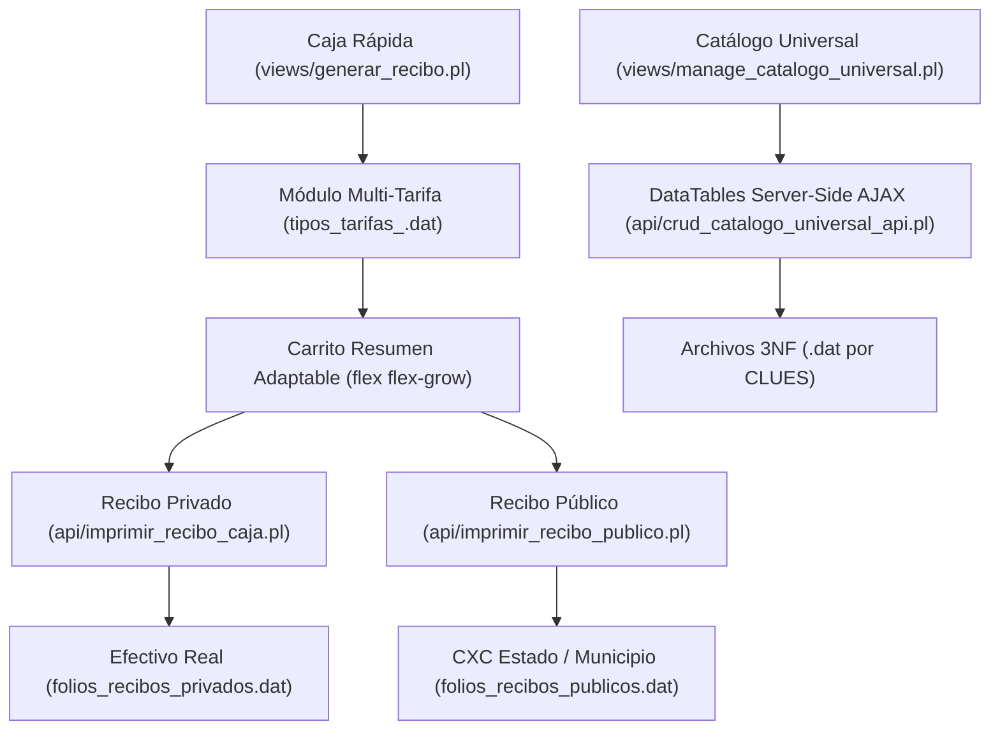

# Documentación Maestra del Sistema OSPulso / SDM 2.0

## 1. Índice General y Rama Documental Principal (`docs/OSPulso 2.0/`)

Esta Documentación Maestra sirve como mapa centralizado para todos los aspectos de arquitectura, diseño de base de datos 3NF, reglas de negocio, flujos financieros, impresión y normatividad del sistema.

### 🌟 Rama Principal y Guías Canónicas (`docs/OSPulso 2.0/`)
- **[ARQUITECTURA_SOAP_ESPECIALIDADES.md](file:///c:/xampp/htdocs/ospulso/docs/OSPulso%202.0/ARQUITECTURA_SOAP_ESPECIALIDADES.md)**: Guía canónica de la Arquitectura SOAP Polimórfica, Contrato JSON Canónico y las 3 Reglas de Oro de Especialidades.
- **[Analisis_Flujo_Consultas_Privado.md](file:///c:/xampp/htdocs/ospulso/docs/OSPulso%202.0/Analisis_Flujo_Consultas_Privado.md)**: Especificación técnica del Wizard Clínico, Guardia de Consulta Única Activa, Tratamientos Abiertos, Cargos Directos y Hub PACS.
- **[OSPulso_Master_Blueprint v2.md](file:///c:/xampp/htdocs/ospulso/docs/OSPulso%202.0/OSPulso_Master_Blueprint%20v2.md)**: Blueprint estratégico de producto, sistema UI/UX Mobile-First, Onboarding de 24h y modelo operativo.
- **[OSPulso_Master_Specification_v1.0.md](file:///c:/xampp/htdocs/ospulso/docs/OSPulso%202.0/OSPulso_Master_Specification_v1.0.md)**: Constitución técnica del ecosistema OSPulso / SDM, motor Multi-Tarifa, Server-Side DataTables e impresión controlada.

---

## 2. Documentos Específicos por Dominio Funcional

### 📚 Arquitectura, Datos y Reglas de Negocio
- **[diccionario_datos_sdm.md](file:///c:/xampp/htdocs/ospulso/docs/diccionario_datos_sdm.md)**: Especificación técnica detallada de la estructura de archivos `.dat`, campos, llaves y tipos de datos por tenant.
- **[modulo_gestion_catalogos.md](file:///c:/xampp/htdocs/ospulso/docs/modulo_gestion_catalogos.md)**: Arquitectura del Catálogo Universal 3NF, DataTables Server-Side AJAX (`deferRender: true`), paginación por defecto (10 registros) y normalización por CLUE.
- **[reglas_negocio.md](file:///c:/xampp/htdocs/ospulso/docs/reglas_negocio.md)**: Compendio formal de reglas de negocio SOAP, catálogos, impresión, gobernanza RBAC y estándares de codificación Perl/JS.
- **[roles.md](file:///c:/xampp/htdocs/ospulso/docs/roles.md)**: Gobernanza y Matriz de Control de Acceso Basado en Roles (RBAC).

### 💰 Finanzas, Caja e Impresión
- **[arquitectura_financiera_tenant.md](file:///c:/xampp/htdocs/ospulso/docs/arquitectura_financiera_tenant.md)**: Fuente Canónica de Verdad para ingresos, segregación de Efectivo Real vs Cuentas por Cobrar (CXC Estado) e integridad contable al centavo.
- **[flujo_caja_rapida.md](file:///c:/xampp/htdocs/ospulso/docs/flujo_caja_rapida.md)**: Proceso operativo de Caja Rápida, arquitectura Multi-Tarifa dinámica en conceptos y estándares UI/UX del carrito.
- **[flujo_impresion_recibos.md](file:///c:/xampp/htdocs/ospulso/docs/flujo_impresion_recibos.md)**: Protocolo unificado de impresión controlada para Recibos Privados y Recibos Públicos con Toolbar `.no-print`.

### 🩺 Atención Clínica y Módulos
- **[flujo_atencion_y_consultas.md](file:///c:/xampp/htdocs/ospulso/docs/flujo_atencion_y_consultas.md)**: Pipeline global de atención médica y estructura JSON SOAP polimórfica.
- **[modulo_visor_medico_dicom.md](file:///c:/xampp/htdocs/ospulso/docs/modulo_visor_medico_dicom.md)**: Visor Médico, adjunto de imágenes radiológicas y estándares DICOM PACS.
- **[modulos_complementarios_sdm.md](file:///c:/xampp/htdocs/ospulso/docs/modulos_complementarios_sdm.md)**: Especificación de Agenda y Citas, Quirófano Kanban y Odontograma SPA.

### ⚙️ Estándares, Diagnóstico y Hoja de Ruta
- **[guia_estilo_sdm.md](file:///c:/xampp/htdocs/ospulso/docs/guia_estilo_sdm.md)**: Tokens de diseño CSS, paleta de colores clínicas y estilos de barras de exportación DataTables.
- **[protocolos_diagnostico_errores.md](file:///c:/xampp/htdocs/ospulso/docs/protocolos_diagnostico_errores.md)**: Diagnóstico de errores HTTP 500, prevención de crashes de renderizado y sigilos.
- **[cumplimiento_y_contribucion.md](file:///c:/xampp/htdocs/ospulso/docs/cumplimiento_y_contribucion.md)**: Cumplimiento NOM-004 / NOM-024 y normas de contribución de código (PR).
- **[pendientes_y_roadmap.md](file:///c:/xampp/htdocs/ospulso/docs/pendientes_y_roadmap.md)**: Lista de tareas completadas y roadmap futuro.

---

## 3. Diagrama de la Arquitectura Global

