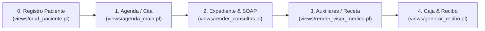

# Flujo Global de Atención Médica y Consultas SOAP Polimórficas

## 1. Pipeline Unificado de Atención Médica

---

## 2. Descripción de las Etapas de Atención

1. **Recepción y Registro**: Alta de datos de identificación y apertura de expediente.
2. **Agendamiento**: Asignación de turno, horario, especialidad y médico en la agenda.
3. **Atención Médica SOAP**: Registro de signos vitales, exploración física y nota clínica.
4. **Auxiliares y Medicamentos**: Emisión de recetas y solicitud de laboratorio o imagenología.
5. **Cierre y Caja**: Emisión del recibo de cobro en ventanilla en **Caja Rápida**.

---

## 3. Contrato JSON SOAP Polimórfico (`views/render_consultas.pl`)

Toda consulta médica utiliza la estructura JSON SOAP canónica:
- **`subjective`**: Anamnesis, padecimiento actual y motivo de consulta.
- **`objective`**: Exploración física, signos vitales y datos dinámicos de especialidad (`soap.objective.especialidad_data`).
- **`assessment`**: Diagnósticos CIE-10 e impresión clínica.
- **`plan`**: Plan terapéutico, recetas, indicaciones y órdenes auxiliares.

### Regla de Oro Polimórfica
El pipeline es **100% único y compartido**. Los subformularios de especialidad (Pediatría, Ginecología, Odontología) se inyectan como componentes modulares desacoplados desde `views/partials/consultas/` o `views/partials/especialidades/`.
